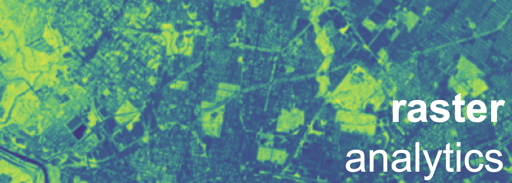

# Raster Analytics

October 17

## Reference & Additional Readings

- [Bounding box tool](http://boundingbox.klokantech.com/)
- [Rasterio documentation](https://rasterio.readthedocs.io/en/latest/index.html)
- [EarthPy examples gallery](https://earthpy.readthedocs.io/en/latest/gallery_vignettes/index.html)
- [Plotting with rasterio](https://rasterio.readthedocs.io/en/stable/topics/plotting.html)
- [LandSat bands](https://www.usgs.gov/faqs/what-are-best-landsat-spectral-bands-use-my-research?qt-news_science_products=0#qt-news_science_products)
- [Tutorial on Landsat data](https://www.earthdatascience.org/courses/earth-analytics-python/multispectral-remote-sensing-in-python/landsat-bands-geotif-in-Python/)
- [Xarray overview](http://xarray.pydata.org/en/stable/quick-overview.html)

